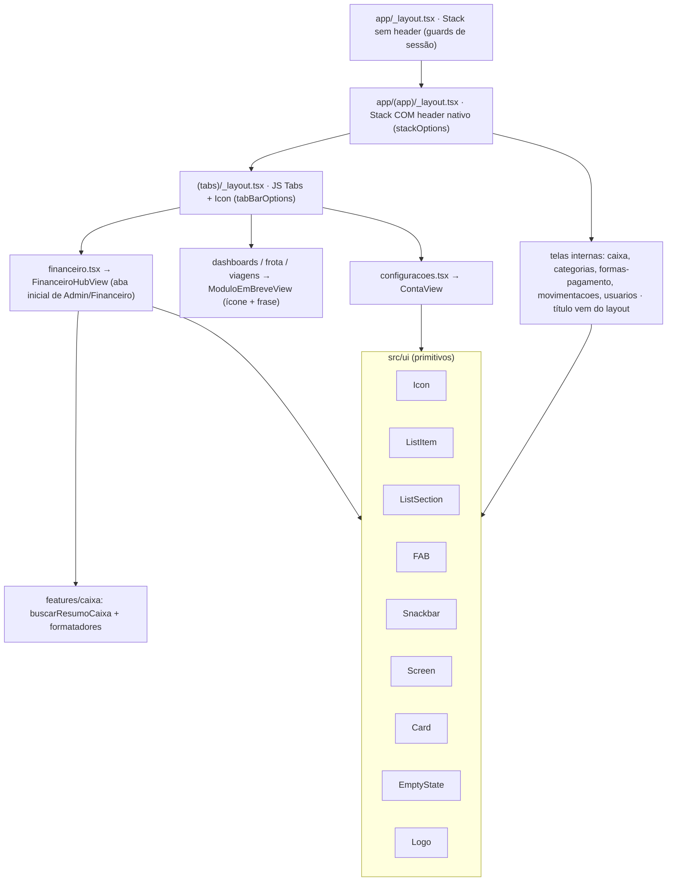

# EIX-58 · Design — App com cara de produto

**Spec**: `.specs/features/eix58-design-app/spec.md`
**Status**: Draft

---

## Architecture Overview

Nada muda no modelo de rotas nem no RBAC (US17). Este épico troca **o chrome**: os `Stack` deixam de esconder o header, a tab bar ganha ícones e as telas passam a ser montadas com cinco primitivos novos. Toda decisão visual continua saindo de `src/ui/tokens.ts`.



**Onde mora cada coisa:**

| Camada | Arquivo | Responsabilidade |
| --- | --- | --- |
| Opções do header | `src/navigation/stackOptions.ts` (novo) | Estilo do header só com tokens, espelho do `tabBarOptions.ts` |
| Títulos das telas | `app/(app)/_layout.tsx` | Um `options={{ title }}` por `Stack.Screen`, no mesmo lugar dos guards |
| Ícone de cada aba | `src/navigation/menu.ts` | Campo `icone` em `Aba`; o layout das abas só lê |
| Mapa de ícones | `src/ui/icons.ts` (novo) | Nome semântico → `{ android, ios }`; tela nunca escreve nome de símbolo |
| Carga de lista | `src/lib/useDadosDaTela.ts` (novo) | Primeira carga, recarga sem piscar, pull-to-refresh, descarte de resposta antiga |

---

## Code Reuse Analysis

### Existing Components to Leverage

| Component | Location | How to Use |
| --- | --- | --- |
| Padrão "recarga sem piscar" | `src/features/caixa/components/SaldoProjecaoView.tsx:35-58` | Base do `useDadosDaTela` (ref `temResumo`, erro em recarga vira Snackbar) |
| Padrão "só a resposta mais recente escreve" | `src/features/movimentacoes/MovimentacoesListView.tsx:56-71` | Também vai para o `useDadosDaTela` (`ultimoPedido`) |
| `tabBarOptions` | `src/navigation/tabBarOptions.ts` | Remove `tabBarIcon: () => null` e `tabBarIconStyle`; mantém cores e alvo de toque |
| `SaldoAtualCard` | `src/features/caixa/components/SaldoAtualCard.tsx` | Conteúdo do cartão de destaque do hub (ganha `onPress` via `Card`) |
| `buscarResumoCaixa`, `formatarMoedaComSinal`, `tomDoValor` | `src/features/caixa/` | Saldo do hub, sem nova chamada ao banco |
| `Badge` | `src/ui/Badge.tsx` | Perfil na Conta e status em Usuários |
| `Avatar`, `profileFromSession` | `src/ui/Avatar.tsx`, `src/features/auth/HomeView.tsx:21` | Cartão da Conta |
| `GoogleLogo` (SVG) | `src/ui/GoogleLogo.tsx` | Molde do `Logo` com `react-native-svg` |
| `isFormaFixa` | `src/features/formas-pagamento/` | Mantém a regra: forma fixa não ganha switch nem edição |
| `Select` (folha inferior) | `src/ui/Select.tsx` | Já é bottom sheet; só troca `animationType` para `slide` |

### Integration Points

| System | Integration Method |
| --- | --- |
| expo-router `Stack` | `screenOptions={stackOptions}` + `headerShown: false` só na tela `(tabs)` |
| expo-router `Tabs` | `tabBarIcon: ({ focused }) => <Icon name={aba.icone} tone={focused ? 'primary' : 'body'} />` |
| `expo-symbols` | `SymbolView` com `name={{ android, ios }}`; no Android desenha Material Symbols por fonte (`@expo-google-fonts/material-symbols`) |
| `Animated` (React Native) | Entrada do Snackbar com driver nativo; `AccessibilityInfo.isReduceMotionEnabled()` tira o deslize. O Reanimated entra na EIX-68 |
| `@react-native-community/datetimepicker` | `DateTimePickerAndroid.open()` imperativo dentro do `CampoData` |
| `expo-constants` | `Constants.expoConfig?.version` na linha "Versão" |

---

## Components

### Icon (`src/ui/Icon.tsx` + `src/ui/icons.ts`)

- **Purpose**: Desenhar um ícone do mapa central em tamanho e cor de token.
- **Interfaces**:
  - `Icon({ name: IconName, size?: keyof typeof iconSize, tone?: TextTone, accessibilityLabel?: string })` — `tone` usa os mesmos nomes e cores do `Text`; nunca recebe cor solta
  - `icons: Record<IconName, { android: AndroidSymbol; ios: SFSymbol }>` — `dashboard`, `financeiro`, `frota`, `viagens`, `configuracoes`, `movimentacoes`, `saldo`, `categorias`, `formasPagamento`, `usuarios`, `adicionar`, `avancar`, `voltarMes`, `avancarMes`, `maisOpcoes`, `calendario`, `limpar`, `alerta`, `sair`, `versao`
  - `iconSize = { sm: 16, md: 20, lg: 24 }` em `tokens.ts`
- **Dependencies**: `expo-symbols` (declarado no `package.json`).
- **Reuses**: paleta `toneColors` do `Text` (exportada para o `Icon` usar a mesma tabela).
- **Regras**: sem `accessibilityLabel` → `accessibilityElementsHidden` + `importantForAccessibility="no-hide-descendants"`; enquanto a fonte carrega, o `SymbolView` já reserva `width/height` (conferido em `node_modules/expo-symbols/build/SymbolView.js`).

### Screen (`src/ui/Screen.tsx`, alterado)

- **Interfaces**: `Screen({ children, align?, scroll?: boolean, underHeader?: boolean, overlay?: ReactNode })`
- `underHeader` troca as `edges` do `SafeAreaView` para `['left','right','bottom']`.
- `scroll` envolve o conteúdo em `KeyboardAvoidingView` (`behavior="padding"`) + `ScrollView` (`keyboardShouldPersistTaps="handled"`, `contentContainerStyle` com o `gap`).
- `overlay` renderiza **fora** do `ScrollView`, em `StyleSheet.absoluteFill` com `pointerEvents="box-none"`: é onde moram `Snackbar` e `FAB`, para não rolarem com o conteúdo.
- Sem nenhuma prop nova, o comportamento é o de hoje — Frota, Rotas e Dívidas (outros devs) continuam compilando.

### ListItem (`src/ui/ListItem.tsx`, estendido)

- **Interfaces**: `ListItem({ title?, subtitle?, icon?: IconName, trailing?: ReactNode, onPress?, accessibilityLabel?, children? })`
- Com `title`, monta a linha padrão: ícone `md` em `textBody` · título (`body`) e subtítulo (`bodySm`, `textBody`, 1 linha com reticências) · `trailing` ou chevron.
- Com `children`, mantém o layout livre de hoje (compatível com as telas existentes e com os PRs abertos).
- Pressionar: `android_ripple={{ color: colors.border }}`; no iOS, fundo `colors.border` enquanto pressionado.

### ListSection (`src/ui/ListSection.tsx`, novo)

- **Interfaces**: `ListSection({ label?: string, children })`
- `label` em `caption` + `textBody` acima do bloco; bloco `surface` + borda 1px `border` + `radius.card` + `overflow: 'hidden'`; separador hairline entre filhos (não depois do último), com padding horizontal `spacing.base` nas linhas.

### FAB (`src/ui/FAB.tsx`, novo)

- **Interfaces**: `FAB({ label: string, onPress, icon?: IconName = 'adicionar', accessibilityLabel?: string })`
- Visual = `Button variant="primary"` + ícone; `position: 'absolute'`, `right: spacing.base`, `bottom: spacing.base + insets.bottom` (`useSafeAreaInsets`). Vai no `overlay` do `Screen`.
- Exporta `FAB_ALTURA_RESERVADA = touchTarget + spacing.base * 2` para as listas usarem como `paddingBottom` (Listas AC 13) e o Snackbar usar como deslocamento.

### Snackbar (`src/ui/Snackbar.tsx`, alterado)

- **Interfaces**: `Snackbar({ message, tone, onDismiss, duration? })` — props atuais intactas.
- `Animated.View` do React Native (driver nativo): `opacity` 0→1 e `translateY` 8pt→0 em 200 ms, `Easing.bezier(0.23, 1, 0.32, 1)`. Só a entrada anima; a saída é a tela desmontando, para não atrasar o `onDismiss`. O Reanimated fica para a EIX-68 (decisão em `spec.md`).
- `AccessibilityInfo.isReduceMotionEnabled()` decide o deslize antes de a animação começar: com "remover animações" ligado, fica só o fade.
- A posição não é do Snackbar: o `overlay` do `Screen` o ancora no rodapé (`padding: spacing.base`) e, com a prop `fab`, o empilha acima do FAB (`gap: spacing.md`). Por isso a prop `aboveFab` saiu.

### Card, EmptyState, Select (alterados, compatíveis)

- `Card({ children, variant?: 'default' | 'feature', onPress?, accessibilityLabel? })` — `feature` usa `radius.feature`; com `onPress` vira `Pressable` com `accessibilityRole="button"`.
- `EmptyState({ ..., icon?: IconName })` — ícone `lg` em `textMuted` acima do título.
- `Select`: `animationType="slide"` (folha sobe de baixo, como no Android).

### Logo (`src/ui/Logo.tsx`, novo)

- **Interfaces**: `Logo({ size?: 'md' | 'lg', withWordmark?: boolean })`
- Marca em `react-native-svg` (duas rodas + eixo, `accentEdge`) + "Eixo Certo" em `subheading`. Os PNGs de ícone e splash saem do mesmo desenho SVG, guardado em `assets/brand/eixo-certo-mark.svg`.

### useDadosDaTela (`src/lib/useDadosDaTela.ts`, novo)

- **Interfaces**: `useDadosDaTela<T>(buscar: () => Promise<Resultado<T>>, deps)` → `{ status: 'carregando' | 'pronto' | 'erro', dados: T | null, erro: string | null, atualizando: boolean, recarregar(): void, puxarParaAtualizar(): Promise<void>, feedbackErro: string | null }`
- Recarrega no `useFocusEffect`. Skeleton só quando ainda não há dado. Falha em recarga com dado na tela vira `feedbackErro` (Snackbar), sem apagar a lista. Resposta antiga (pedido não mais recente) é descartada.
- Usa o tipo de resultado `{ ok: true, data } | { ok: false, mensagem }` que os repositórios já devolvem.

### FinanceiroHubView (`src/navigation/FinanceiroHubView.tsx`, novo)

- Cabeçalho `heading` "Financeiro" (aba não tem header nativo) → `Card variant="feature" onPress → /caixa` com `SaldoAtualCard` → `ListSection` com 4 linhas → `FAB "Nova movimentação"`.
- Erro do saldo fica **dentro do cartão** (`EmptyState` compacto + "Tentar novamente"); o menu nunca depende do saldo.

### ModuloEmBreveView (alterado) e ContaView (renomeia `HomeView`)

- `ModuloEmBreveView({ titulo, icone, descricao })` — sai a prop `atalhos` (o Financeiro deixa de usar).
- `ContaView`: cartão (Avatar, nome, e-mail, `Badge` do perfil) → `ListSection` "Administração" (Usuários, só Admin) → `ListSection` "Aplicativo" (Versão) → `Button ghost "Sair"`.

---

## Data Models

Nenhum. O épico só lê o que já existe (`resumo_caixa`, perfil do `useProfile`, metadados da sessão).

```typescript
// src/navigation/menu.ts — único campo novo
type Aba = { id: AbaId; rotulo: string; icone: IconName; pode: (u: PerfilDoUsuario | null) => boolean };
```

---

## Error Handling Strategy

| Error Scenario | Handling | User Impact |
| --- | --- | --- |
| Saldo do hub falha | Erro só no cartão, com "Tentar novamente" | Menu continua usável |
| Recarga de lista falha com itens na tela | `feedbackErro` → Snackbar de erro | Lista antiga continua visível |
| Primeira carga de lista falha | `EmptyState` de erro com "Tentar novamente" (como hoje) | Mensagem em português |
| Fonte do Material Symbols ainda não carregou | `SymbolView` reserva o tamanho | Ícone aparece sem empurrar o layout |
| Usuário cancela o calendário | `DateTimePickerAndroid` devolve `dismissed`; valor não muda | Nada acontece |
| Falha do `expo-haptics` (P2) | `catch` silencioso | A ação conclui normalmente |

---

## Risks & Concerns

| Concern | Location (file:line) | Impact | Mitigation |
| --- | --- | --- | --- |
| PR aberto da Frota (EIX-37, Diogo) também altera o layout da pilha | `app/(app)/_layout.tsx:14` | Conflito de merge na EIX-60 | Mergear o PR #7 antes da EIX-60; se não der, o Jean resolve o conflito **com o Diogo** (AGENTS.md §3) |
| EIX-34 (Eduardo) mexe no formulário de movimentação | `src/features/movimentacoes/MovimentacaoFormView.tsx:251-276` | Conflito ao tirar o título do conteúdo e ligar `Screen scroll` | Avisar o Eduardo na EIX-34; quem mergear depois rebaseia; conflito com código dele é resolvido junto |
| Telas novas de outros devs (Frota, Rotas, Dívidas) nascem no padrão antigo | `src/features/veiculos/**` (PR #7), EIX-38, EIX-50 | Tela inconsistente no vídeo | `DESIGN_CYAN.md` §7 documenta os primitivos (UIP-06); o header vem do layout automaticamente; adoção completa fica para cada task ou para a EIX-72 |
| `npm 11` local reescreve o lockfile e quebra o `npm ci` do CI | `package-lock.json` | CI vermelho nas tasks que instalam dependência | Instalar com `npx -y npm@10 install <pacote>` e validar com `npx -y npm@10 ci --dry-run --ignore-scripts` |
| `node_modules` local incompleto (sem `@expo`, `@babel`, `@expo-google-fonts`) desde 06/10 16:01 | `node_modules/` | `npm run test` falha antes de qualquer task | `npm ci` antes da EIX-60 |
| `SymbolView` chama `expo-font.loadAsync` no Android | `node_modules/expo-symbols/build/SymbolView.js:16` | Teste de componente com ícone pode quebrar no Jest | Mock de `expo-symbols` em `jest.setup.ts` (desenha um `View` com `testID` do nome) |
| Reanimated no Jest | `src/ui/Snackbar.tsx` | Testes do Snackbar e de telas com feedback | `require('react-native-reanimated').setUpTests()` no `jest.setup.ts`; testes continuam afirmando texto e `accessibilityRole="alert"`, não animação |
| Teclado no Android edge-to-edge (SDK 57) | `src/ui/Screen.tsx` | Campo ou botão "Salvar" atrás do teclado (tell #20) | `KeyboardAvoidingView behavior="padding"` testado no emulador em Nova movimentação; se falhar, abrir issue para `react-native-keyboard-controller` (pede autorização) |
| Datetimepicker é módulo nativo | `package.json` | Todo dev precisa refazer o development build | EIX-65 por último no P0, com aviso no grupo antes do merge |
| Build de release assinado com outra chave | `android/app/build.gradle` (gerado) | "Continuar com Google" falha no APK de release (SHA-1 diferente) | Conferir `signingConfigs.release` no prebuild; se a chave mudar, registrar o SHA-1 no Google Cloud (ação do Jean) |
| Testes atuais afirmam a UI antiga | `src/navigation/__tests__/ModuloEmBreveView.test.tsx:17-22`, `menu.test.ts:44`, `features/auth/__tests__/HomeView.test.tsx`, testes das listas | Falham após a mudança | Reescrever a partir dos novos ACs (a spec mudou); nunca apagar teste sem substituto |

---

## Tech Decisions

| Decision | Choice | Rationale |
| --- | --- | --- |
| Biblioteca de ícones | `expo-symbols` (Material Symbols no Android) | Já vem com o expo-router; é o que as skills oficiais pedem; Material casa com a "base Material Design" citada na EIX-54 |
| Nome de ícone na tela | Nome semântico do mapa `icons.ts` | Iniciante não precisa saber nome de símbolo; troca de ícone num lugar só |
| Onde ficam os títulos | `options.title` no `app/(app)/_layout.tsx` | Mesmo arquivo dos guards; uma tela nunca configura o próprio chrome |
| Carga das listas | Hook `useDadosDaTela` | Os 4 padrões copiados à mão já divergiram; um hook só testado uma vez |
| FAB e Snackbar fora do scroll | Prop `overlay` no `Screen` | Sem `position: absolute` espalhado em tela |
| Precedência skills × guia | `DESIGN_CYAN.md` vence | Fonte única de verdade visual (AGENTS.md §0) |

> **Decisão de projeto:** a precedência do DESIGN_CYAN sobre as skills `expo-*` vira AD-009 no `STATE.md`.
