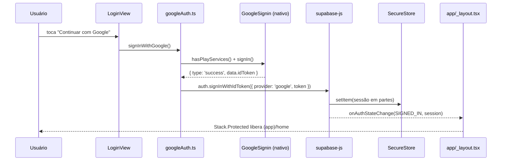

# US15 — Login com Google Design

**Spec:** `.specs/features/us15-login-google/spec.md`

## Fluxo

Na abertura do app, `sessionStore.init()` chama `supabase.auth.getSession()` (lê do SecureStore) e só
então esconde a splash. O layout raiz nunca navega manualmente: ele troca o `guard` do
`Stack.Protected` conforme a sessão, e o expo-router redireciona sozinho.

## Componentes

| Arquivo | Responsabilidade | Depende de |
|---|---|---|
| `src/lib/env.ts` | Lê e valida `EXPO_PUBLIC_*` com Zod | zod |
| `src/supabase/secureStorage.ts` | Adapter `getItem/setItem/removeItem` com partes no SecureStore | expo-secure-store |
| `src/supabase/client.ts` | Instância única do `supabase-js` | env, secureStorage |
| `src/features/auth/errors.ts` | `AuthErrorCode` + mensagens em português | — |
| `src/features/auth/googleAuth.ts` | `configureGoogleSignIn`, `signInWithGoogle`, `signOut` | google-signin, client, errors |
| `src/features/auth/sessionStore.ts` | Zustand: `session`, `isRestoring`, `init()` | client |
| `src/ui/*` | tokens + `Screen`, `Text`, `Button`, `Card` | tokens |
| `src/features/auth/LoginView.tsx` | UI do Login (estado local de loading/erro) | ui, googleAuth |
| `src/features/auth/HomeView.tsx` | UI da Home com dados da sessão | ui, googleAuth, sessionStore |
| `app/_layout.tsx` | Fontes, splash, `Stack.Protected` por sessão | sessionStore |
| `app/(auth)/login.tsx`, `app/(app)/home.tsx` | Rotas finas que só renderizam as Views | Views |

## Tech Decisions (locais à feature)

| Decisão | Escolha | Motivo |
|---|---|---|
| `signInWithGoogle` retorna resultado em vez de lançar | `{ ok: true } \| { ok: false, code }` | A tela decide a mensagem sem `try/catch` espalhado; cancelamento vira `code: 'cancelled'` e a tela não mostra nada |
| Tamanho da parte no SecureStore | 1800 caracteres | Margem abaixo do aviso de 2048 bytes |
| Índice das partes | chave `<key>.count` + `<key>.0..n` | SecureStore só aceita `[A-Za-z0-9._-]` em chaves; leitura sabe quantas partes buscar |
| Views separadas das rotas | `LoginView`/`HomeView` em `features/auth` | Testáveis sem montar o router; rotas ficam com 3 linhas |
| Onde chamar `GoogleSignin.configure` | Uma vez no layout raiz | A doc da lib exige configurar antes de `signIn` |

Decisões de projeto (lib nativa, SecureStore com partes, Supabase na nuvem) ficam em `.specs/STATE.md` e no ADR 0001.
